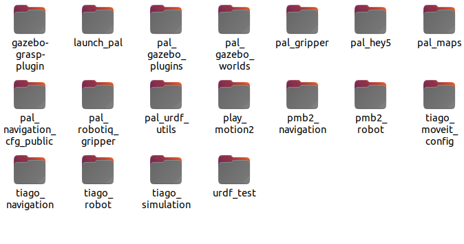
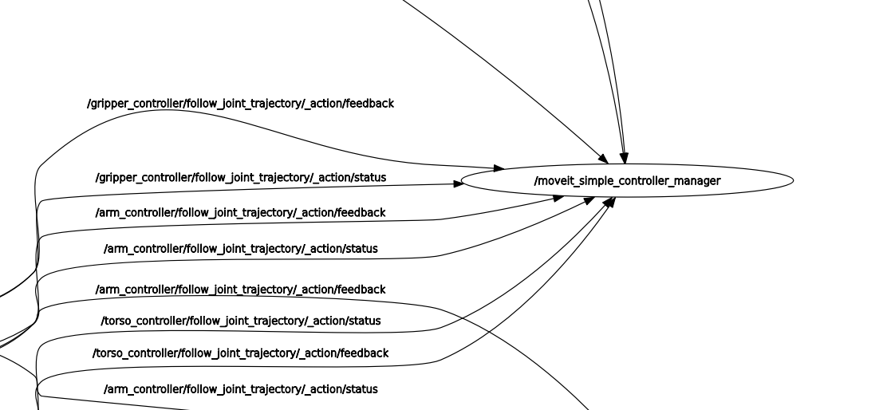
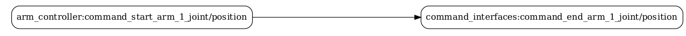
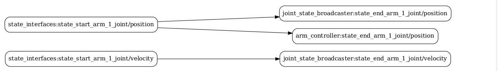
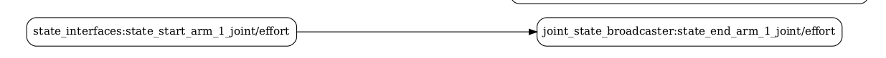

# STERO_25Z_MP_MS

## Osoby w zespole

Michał Paradowski;

Mateusz Sosnowski

## Zadanie 1

Po wywołaniu komendy 

``` vcs import --input https://raw.githubusercontent.com/RCPRG-ros-pkg/STERO2/refs/heads/iron/tiago_public_stero.repos src```


W katalogu ./src pojawiły się katalogi:  

## Zadanie 2

Po wywołaniu komend

 ```source /opt/ros/iron/setup.bash ```
 
 ```colcon build --symlink-install```

 wszystkie (40) paczki zostały zbudowane
 
 Parametr --symlink-install powoduje, że zamiast kopiować pliki do katalogu install/, tworzone są dowiązania symboliczne do oryginalnych plików w src/, co umożliwia szybkie testowanie zmian bez ponownego budowania.

 ## Zadanie 3

 Po uruchomieniu węzła komendą ```ros2 run hello_stero hello_stero_node ``` 
 pojawił się komunikat: 
 
 ```hello world hello_stero package``` 

 ## Zadanie 4

Po wywołaniu komendy 

```ros2 action info /execute_trajectory``` 
Otzymano komunikat:

```
Action: /execute_trajectory
Action clients: 1
    //p/l/a/y/_/m/o/t/i/o/n/2_move_group_node
Action servers: 1
    /move_group
```

A więc klient to ```//p/l/a/y/_/m/o/t/i/o/n/2_move_group_node```
A węzeł udostepniający to ```/move group```

## Zadanie 5
Zaplanowano i wykonano ruch w Rvizz.

Po wywołaniu komendy w trakcie ruchu

```ros2 action info /execute_trajectory``` 

Otrzymano komunikat

```
Action: /execute_trajectory
Action clients: 2
    //p/l/a/y/_/m/o/t/i/o/n/2_move_group_node
    /rviz
Action servers: 1
    /move_group
```

zgodnie z oczekiwaniami został wykryty nowy kient ```rviz```.

## Zadanie 6

Znaleziono dla węzły zaczynające się od ```/move_group```:

1) ```/move_group```:
```
  Service Servers:
    /apply_planning_scene: moveit_msgs/srv/ApplyPlanningScene
    /check_state_validity: moveit_msgs/srv/GetStateValidity
    /clear_octomap: std_srvs/srv/Empty
    /compute_cartesian_path: moveit_msgs/srv/GetCartesianPath
    /compute_fk: moveit_msgs/srv/GetPositionFK
    /compute_ik: moveit_msgs/srv/GetPositionIK
    /get_planner_params: moveit_msgs/srv/GetPlannerParams
    /load_map: moveit_msgs/srv/LoadMap
    /move_group/describe_parameters: rcl_interfaces/srv/DescribeParameters
    /move_group/get_parameter_types: rcl_interfaces/srv/GetParameterTypes
    /move_group/get_parameters: rcl_interfaces/srv/GetParameters
    /move_group/get_type_description: type_description_interfaces/srv/GetTypeDescription
    /move_group/list_parameters: rcl_interfaces/srv/ListParameters
    /move_group/set_parameters: rcl_interfaces/srv/SetParameters
    /move_group/set_parameters_atomically: rcl_interfaces/srv/SetParametersAtomically
    /plan_kinematic_path: moveit_msgs/srv/GetMotionPlan
    /query_planner_interface: moveit_msgs/srv/QueryPlannerInterfaces
    /save_map: moveit_msgs/srv/SaveMap
    /set_planner_params: moveit_msgs/srv/SetPlannerParams

  Action Servers:
    /execute_trajectory: moveit_msgs/action/ExecuteTrajectory
    /move_action: moveit_msgs/action/MoveGroup
```
Na podstawie udostępniancyh serwisów wnioskujemy że ```/move_goup``` jest odpowiedzialne za planowanie i wykonywanie całego procesu ruchu.

2) ```move_group_private_100999223382864```
```
Service Servers:
    /get_planning_scene: moveit_msgs/srv/GetPlanningScene
    /move_group_private_100999223382864/describe_parameters: rcl_interfaces/srv/DescribeParameters
    /move_group_private_100999223382864/get_parameter_types: rcl_interfaces/srv/GetParameterTypes
    /move_group_private_100999223382864/get_parameters: rcl_interfaces/srv/GetParameters
    /move_group_private_100999223382864/get_type_description: type_description_interfaces/srv/GetTypeDescription
    /move_group_private_100999223382864/list_parameters: rcl_interfaces/srv/ListParameters
    /move_group_private_100999223382864/set_parameters: rcl_interfaces/srv/SetParameters
    /move_group_private_100999223382864/set_parameters_atomically: rcl_interfaces/srv/SetParametersAtomically

  Action Servers:
```
Na podstawie udostępniancyh serwisów wnioskujemy że ```move_group_private_100999223382864``` jest wewnętrznym (pomocniczym) węzłem stworzonym przez główny ```/move_goup```


## Zadanie 7



Analizując rqt plot można wywnioskować że ```/moveit_simple_controller_manager``` służy do nadzoru nad stanami wszystkich przegubów. Nie publikuje on na żadnych kanałach

## Zadanie 8


Po wywołaniu komendy:
``` ros2 control list_hardware_interfaces ```

Wszystkie dostępne interfejsy:
```
	arm_1_joint/effort [available] [unclaimed]
	arm_1_joint/position [available] [claimed]
	arm_1_joint/velocity [available] [unclaimed]
	arm_2_joint/effort [available] [unclaimed]
	arm_2_joint/position [available] [claimed]
	arm_2_joint/velocity [available] [unclaimed]
	arm_3_joint/effort [available] [unclaimed]
	arm_3_joint/position [available] [claimed]
	arm_3_joint/velocity [available] [unclaimed]
	arm_4_joint/effort [available] [unclaimed]
	arm_4_joint/position [available] [claimed]
	arm_4_joint/velocity [available] [unclaimed]
	arm_5_joint/effort [available] [unclaimed]
	arm_5_joint/position [available] [claimed]
	arm_5_joint/velocity [available] [unclaimed]
	arm_6_joint/effort [available] [unclaimed]
	arm_6_joint/position [available] [claimed]
	arm_6_joint/velocity [available] [unclaimed]
	arm_7_joint/effort [available] [unclaimed]
	arm_7_joint/position [available] [claimed]
	arm_7_joint/velocity [available] [unclaimed]
	gripper_left_finger_joint/position [available] [claimed]
	gripper_right_finger_joint/position [available] [claimed]
	head_1_joint/position [available] [claimed]
	head_2_joint/position [available] [claimed]
	torso_lift_joint/position [available] [claimed]
	wheel_left_joint/velocity [available] [claimed]
	wheel_right_joint/velocity [available] [claimed]

```
A więc dla każdego przegubu dostepne niektóre z opcji: effort, position, velocity. Natomiast ```arm_1_joint/position``` jest jedynym wykorzystywanym dotyczącym arm_1


Otrzymano następujące interfejsy stanu (dotyczące arm_1):
```
state interfaces
	arm_1_joint/effort
	arm_1_joint/position
	arm_1_joint/velocity
```

## Zadanie 9

Poniżej wymieniono wszystkie połączenia (arm_1_joint) w ros2_control.



