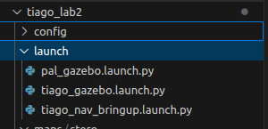
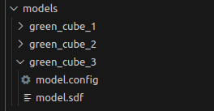
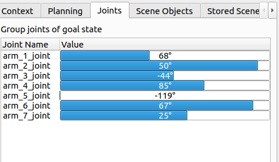
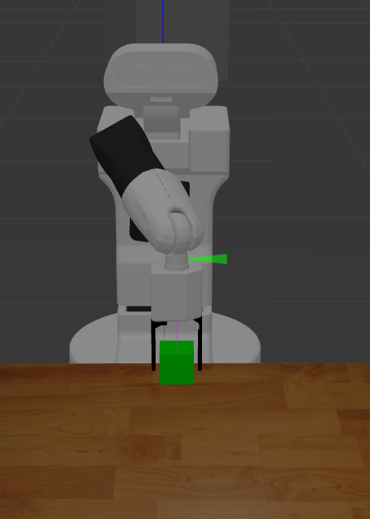
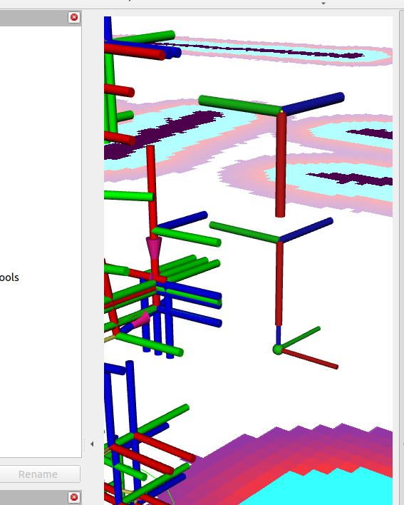
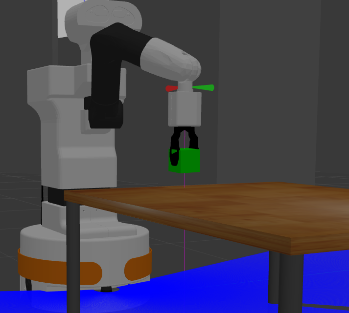
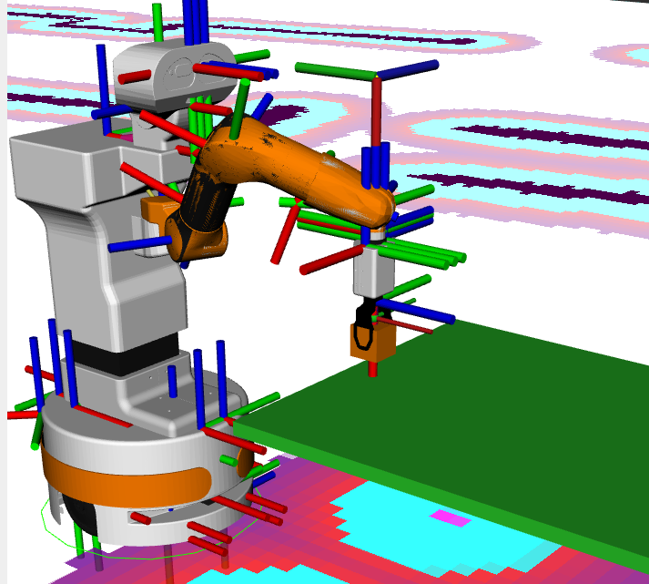

# Zadanie 1
Utworzono pliki uruchomieniowe:





# Zadanie 2

Komenda użyta do uruchomienia system TIAGo z nowo utworzonym światem: 
```
ros2 launch tiago_lab2 tiago_gazebo.launch.py navigation:=True moveit:=True is_public_sim:=True world_name:=stero
```


# Zadanie 3
Do wyświetlania serviców oraz topiców dla /gazebo_ros_state po aktywowaniu węzła wykorzystaliśmy polecenie: 

```
ros2 node info /gazebo_ros_state
```
## /gazebo_ros_state – tematy i serwisy

## Tematy
- **/model_states** (`gazebo_msgs/msg/ModelStates`)  
  **Pola:** `string[] name`, `geometry_msgs/Pose[] pose`, `geometry_msgs/Twist[] twist`  
  **Do czego:** strumień pozycji i prędkości **wszystkich modeli** w symulacji (po nazwach modeli).

- **/link_states** (`gazebo_msgs/msg/LinkStates`)  
  **Pola:** `string[] name`, `geometry_msgs/Pose[] pose`, `geometry_msgs/Twist[] twist`  
  **Do czego:** strumień pozycji i prędkości **wszystkich członów (linków)** (`model::link`).

## Serwisy
- **/get_entity_state** (`gazebo_msgs/srv/GetEntityState`)  
  **Request:** `string name`, `string reference_frame`  
  **Response:** `geometry_msgs/Pose pose`, `geometry_msgs/Twist twist`, `bool success`, `string status_message`  
  **Cel:** pobranie pozycji i prędkości konkretnego modelu lub linku w wybranym układzie odniesienia.

- **/set_entity_state** (`gazebo_msgs/srv/SetEntityState`)  
  **Request:** `gazebo_msgs/EntityState state` → `name`, `pose`, `twist`, `reference_frame`  
  **Response:** `bool success`, `string status_message`  
  **Cel:** ustawienie/teleportacja encji w określonym układzie odniesienia.

## Przykłady wywołań

**Pobranie stanu linku:**
```bash
ros2 service call /get_entity_state gazebo_msgs/srv/GetEntityState \
"{name: 'tiago::arm_1_link', reference_frame: 'map'}"
```

# Zadanie 4:
Dodano do bazy modeli 3 nowe modele, uwzględniono w launch nową ścieżkę:



# Zadanie 5: Analiza układów współrzędnych dla operacji chwytania

To zadanie polegało na identyfikacji i analizie kluczowych układów współrzędnych wykorzystywanych w operacjach chwytania robota TIAGo.

Wykorzystano prosty skrypt by uzyskać:

### Istotne układy współrzędnych
- **B (Układ planowania)**: `base_footprint` – bazowy układ odniesienia używany do planowania ruchu  
- **E (Układ efektora końcowego)**: `arm_tool_link` – układ odniesienia efektora końcowego  
- **F (Układ chwytaka)**: `wrist_ft_link` – układ używany do operacji chwytania w symulatorze Gazebo  

### Transformacja między układami E i F
Transformacja pomiędzy efektorem końcowym (E) a chwytakiem (F):

```
  tf2::Transform cube_to_top_gripper(
    tf2::Quaternion(tf2::Vector3(0.0, 1.0, 0.0), M_PI_2),
    tf2::Vector3(0.0, 0.0, cube_half_height)
  );

  tf2::Transform cube_to_pregrasp_gripper(
    cube_to_top_gripper.getRotation(),
    cube_to_top_gripper.getOrigin() + tf2::Vector3(0.0, 0.0, approach_clearance)
  );

  tf2::Transform target_eef_in_base = cube_in_base * cube_to_top_gripper * e_to_gripper_tf.inverse();
  tf2::Transform pregrasp_eef_in_base = cube_in_base * cube_to_pregrasp_gripper * e_to_gripper_tf.inverse();
```
Gdzie ee_frame i gripper_frame to E i F zdefiniowane powyżej.

- **Translacja**  [x y z] = [0.6848 0.0348 0.7858]
- **Rotacja**: [x y z w] = [0.5012 -0.4988 -0.5008 -0.4992]


### Weryfikacja
Relacje między układami współrzędnych można zweryfikować poleceniem:
```bash
ros2 run tf2_ros tf2_echo arm_tool_link gripper_grasping_frame
```
# Zadanie 6
Odczytanie pozycji jointów:



Pozycja grippera:




# Zadanie 8, 9, 10

Zaimplementowano węzęł one_grasp z potrzbnymi funckjami. Wypisano pozycję kostki:
```
green_cube_3 position [x y z] = [0.6856 0.0410 0.5502]
```
Wyświetlona pozycja kostki, końcówki jaka musi osiągnąć gripper oraz pozycji którą musi osiągnąć przed wykonaniem chwytu w rvizz:



# Zadanie 11
Wykonano i zaprezentowano:



# Zadanie 12
Dodano obiekty koliziyjne w rviz:



